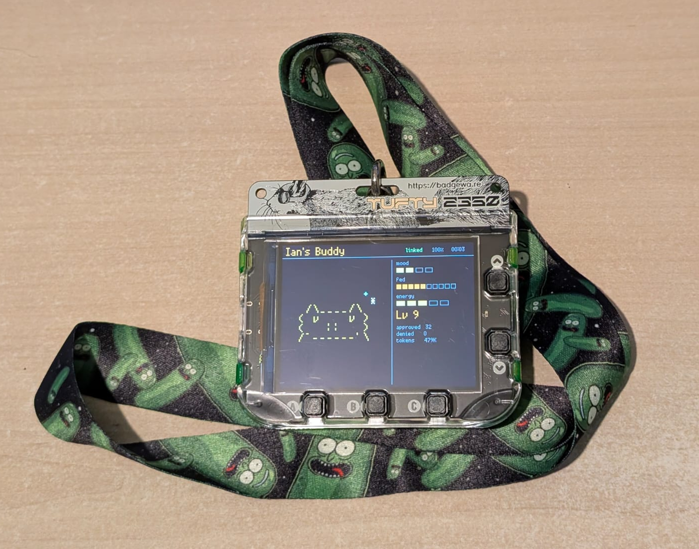
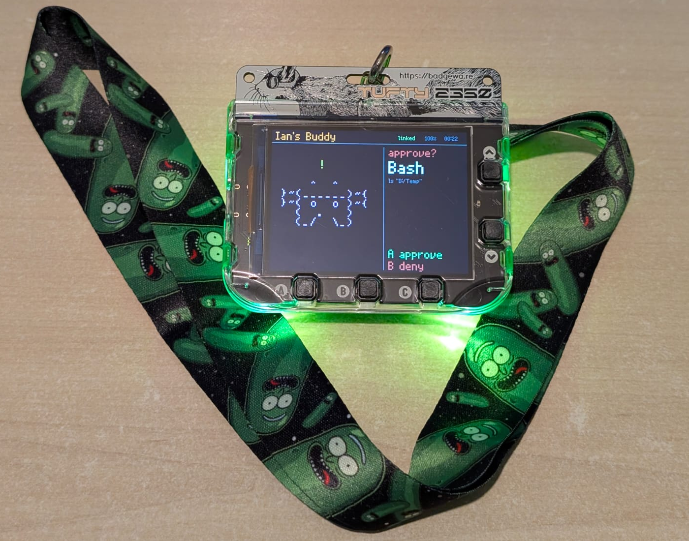

# claude-desktop-buddy

Claude for macOS and Windows can connect Claude Cowork and Claude Code to
maker devices over BLE, so developers and makers can build hardware that
displays permission prompts, recent messages, and other interactions. We've
been impressed by the creativity of the maker community around Claude -
providing a lightweight, opt-in API is our way of making it easier to build
fun little hardware devices that integrate with Claude.

> **Building your own device?** You don't need any of the code here. See
> **[REFERENCE.md](REFERENCE.md)** for the wire protocol: Nordic UART
> Service UUIDs, JSON schemas, and the folder push transport.

As an example, we built a desk pet that lives off permission approvals and
interaction with Claude. It sleeps when nothing's happening, wakes when
sessions start, gets visibly impatient when an approval prompt is waiting,
and lets you approve or deny right from the device.

<p align="center">
  
  
</p>

## Hardware

This fork targets the **[Pimoroni Tufty 2350](https://shop.pimoroni.com/products/tufty-2350)**
(RP2350B + RM2 wireless module, 320×240 IPS LCD, 5 buttons, 4-zone case LEDs).
The original M5StickC Plus firmware lives in git history on `main` before
the Tufty port commits.

## Building

You'll need three repos on disk and three env vars pointing at them:

| Env var | Repo |
| --- | --- |
| `PICO_SDK_PATH` | <https://github.com/raspberrypi/pico-sdk> (2.0+) |
| `PIMORONI_PICO_PATH` | <https://github.com/pimoroni/pimoroni-pico> |
| `PIMORONI_TUFTY2350_PATH` | <https://github.com/pimoroni/tufty2350> |

Plus a build toolchain:

- **CMake 3.13+** and **Ninja**
- **ARM GCC** (`arm-none-eabi-gcc`) for the target
- A **host C++ compiler** — pico-sdk builds `pioasm` and `picotool` from
  source as native binaries during configure. On Windows, MinGW-w64 (e.g.
  WinLibs UCRT) is the standard choice.
- **Python 3** — pico-sdk's build scripts need it on PATH

Configure and build:

```sh
cmake -S . -B build -G Ninja
ninja -C build
```

Outputs land in `build/claude_buddy.uf2` (drag-to-flash) plus the usual
`.elf`/`.bin`/`.hex` companions.

## Flashing

Hold the **BOOT** button on the back of the Tufty while plugging it into
USB. It mounts as a USB drive (`RP2350` or similar). Drag
`build/claude_buddy.uf2` onto the drive; the Tufty reboots automatically
into the new firmware.

## Pairing

To pair your device with Claude, first enable developer mode (**Help →
Troubleshooting → Enable Developer Mode**). Then, open the Hardware Buddy
window in **Developer → Open Hardware Buddy…**, click **Connect**, and pick
your device from the list. macOS will prompt for Bluetooth permission on
first connect; grant it.

<p align="center">
  
  
</p>

Once paired, the bridge auto-reconnects whenever both sides are awake.

If discovery isn't finding the device:

- Make sure it's awake (any button press)
- Check the top-bar indicator on the device — `scanning` means it's advertising

### Using Claude Code CLI instead

The pairing flow above is for the Claude Desktop app, which is the only
client the upstream bridge supports. If you'd rather drive the Buddy from a
terminal `claude` session, see
**[Vibe Notch Windows](https://github.com/Xefan/vibe-notch-windows)** — a
companion app that listens to Claude Code hook events (tool calls,
permission prompts, completions) and bridges them to the Buddy over BLE in
the same wire format the Desktop app uses. Windows only.

## Controls

The Tufty 2350 has five front buttons (A, B, C, Up, Down) plus a back
RESET button. Roles vary by context:

| Button             | Home (PET / INFO)         | Approval prompt | Menu open       |
| ------------------ | ------------------------- | --------------- | --------------- |
| **A** (front)      | cycle view (PET ↔ INFO)   | **approve**     | activate item   |
| **B** (front)      | —                         | **deny**        | close menu      |
| **C** (front)      | toggle screen on/off      | —               | —               |
| **Up** (front)     | previous buddy species    | —               | previous item   |
| **Down** (front)   | next buddy species        | —               | next item       |
| **Hold A** 600ms   | open settings menu        | —               | —               |
| **RESET** (back)   | tap = chip reset · hold 2s = dormant power-off (any front button wakes) |

The screen auto-powers-off after 30s of no interaction while running on
battery (kept on while connected to USB or while an approval prompt is up).
Any button press wakes it; the **Wake on activity** setting (Settings menu)
also wakes the screen when new Claude session events arrive.

> The Tufty's RESET button is hardware-tied to the RP2350's reset line, so a
> tap reboots the chip before firmware can react. Only the long-press path
> (handled while the chip is still running) lands in the dormant-sleep
> code. Screen toggling lives on C for the same reason.

## Buddies

Eighteen ASCII buddies, each with seven animations (sleep, idle, busy,
attention, celebrate, dizzy, heart). Press **Up** or **Down** on the home
screen to cycle between them. The choice persists across reboots.

> **GIF characters** (the folder-push-uploaded animated character packs from
> the upstream M5StickC Plus port) are **not yet implemented in the Tufty
> port**. ASCII species above are the only supported buddies for now.
> Restoring GIF support is on the roadmap.

## The seven persona states

| State       | Trigger                                            | Feel                        |
| ----------- | -------------------------------------------------- | --------------------------- |
| `sleep`     | no session activity for 2+ minutes                 | eyes closed, slow breathing |
| `idle`      | connected, nothing urgent, or recent activity      | blinking, looking around    |
| `busy`      | one or more sessions actively running              | sweating, working           |
| `attention` | approval prompt pending                            | alert, **case LEDs pulse**  |
| `celebrate` | level up (every 50K tokens) or session completion  | confetti, bouncing          |
| `heart`     | approved in under 5s                               | floating hearts             |
| `dizzy`     | (not currently triggered — Tufty has no IMU)       | spiral eyes, wobbling       |

## Project layout

```
src/
  main.cpp        — main loop, UI screens, persona routing
  buddy.{h,cpp}   — ASCII species dispatch + render helpers
  buddy_common.h  — drawing helpers shared by species files
  buddies/        — one file per species (18), seven anim functions each
  ble_bridge.{h,cpp} — Nordic UART service via BTstack
  data.{h,cpp}    — wire protocol, JSON parse
  battery.{h,cpp} — VBAT_SENSE ADC, USB detect, LiPo % estimation
  buttons.{h,cpp} — five front-button polling
  menu.{h,cpp}    — hold-A settings menu
  power.{h,cpp}   — RESET long-press → dormant sleep
  rtc.{h,cpp}     — PCF85063A I2C real-time clock
  settings.{h,cpp} — flash-persisted settings (owner, species, prefs)
  stats.{h,cpp}   — flash-persisted stats (approvals, denials, level, tokens)
  drivers/st7789/ — vendored Pimoroni Tufty 2350 ST7789 driver
  lib/            — vendored single-header ArduinoJson
```

## Availability

The BLE API is only available when the desktop apps are in developer mode
(**Help → Troubleshooting → Enable Developer Mode**). It's intended for
makers and developers and isn't an officially supported product feature.
